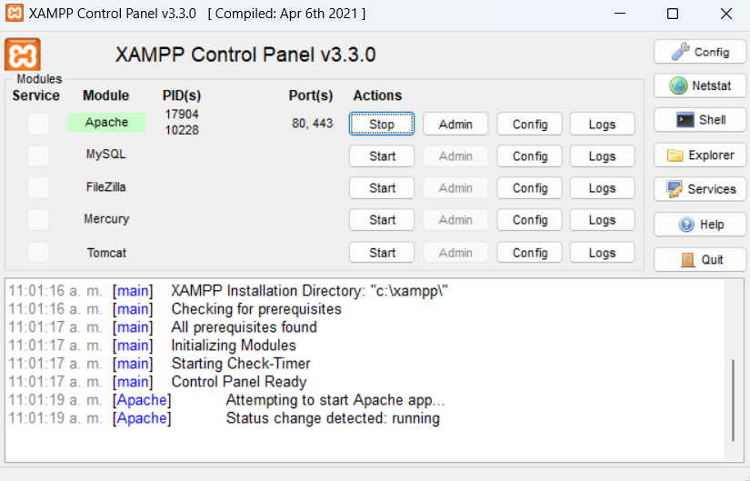

# WELCOME TO TWITTER PHP CLONE

## Steps:

**1.** To get started first you will need to clone this repository by using:\
 `git clone https://github.com/caoh29/php-twitter.git`

**2.** Then you will need to download Docker Desktop:\  
 `https://www.docker.com/products/docker-desktop/`

**3.** Install Docker desktop and Execute it!\

**4.** Go to the /db folder\
 `cd db`

**5.** Execute the following command to download a MySQL database image and Run it in the background for future queries:\
 `docker-compose up -d`

**6.** You will also need an Apache server, I suggest you to install XAMPP:\
 `https://www.apachefriends.org/download.html`

**7.** Install it and Execute it\

**8.** Run the Apache server by pressing on START:\
 

**9.** That's it for the configuration, now go to your favourite browser and search:\
 `http://localhost/assign-2/index.php`
